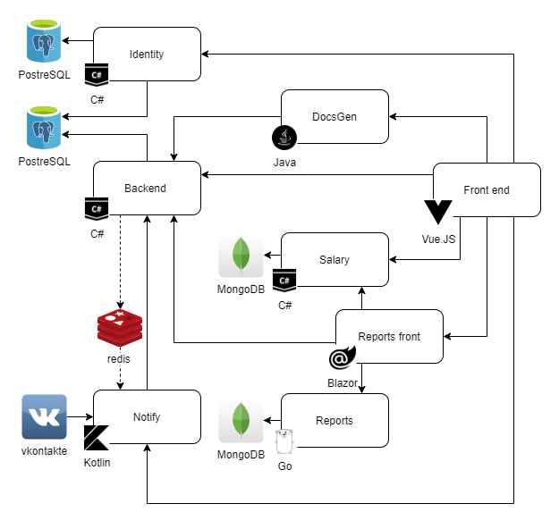

# ITLab
Laboratory managing system

### Default user
* login: `admin`
* password: `Pa$$word1243`


## Run system locally from Docker images
Requirements

- Docker

1. Pull services images
    > Powershell
    ```bash
    . .\alias.ps1
    idc pull
    ```
2. Run services
    > Powershell
    ```bash
    idc
    ```


## Run development environment
Requirements

- .Net Core 3.1
- Node.js 12.18.2+
- Go 1.12+
- JDK 11+
- Docker


1. Build all services
    1. Build front
        1. Add environmental variables by using command:
            > Powershell
            ```bash
            . .\ITLab-Front-Root\environment.dev.ps1
            ```
            > Bash
            ```bash
            . ./ITLab-Front-Root/environment.dev.sh
            ```
        2. Install [jake](https://jakejs.com/)
            ```bash
            npm i -g jake
            ```
        3. Build front
            ```bash
            cd ./ITLab-Front-Root
            jake
            cd ..
            ```
    2. Build back
        1. Add environmental variables by using command:
            > Powershell
            ```bash
            . .\ITLab-Back-Root\environment.dev.ps1
            ```
            > Bash
            ```bash
            . ./ITLab-Back-Root/environment.dev.sh
            ```
        2. Build back
            ```bash
            cd ./ITLab-Back-Root
            ./build
            cd ..
            ```
2. Build docker images
    > Powershell
    ```bash
    . ./alias.ps1  # alias for docker compose
    idc build
    ```
3. Run services
    > Powershell
    ```bash
    idc up -d
    ```
General site will be available on [http://127.0.0.1.xip.io:5500](http://127.0.0.1.xip.io:5500)
> Default user: email="`admin@test.com`" password="`password`"
## Architecture
### Current

### To be

