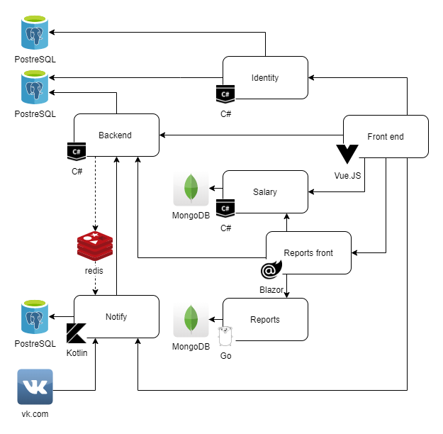

# ITLab
Laboratory managing system

Requirements

- .Net Core 3.1
- Node.js 12.18.2+
- Go 1.12+
- JDK 11+
- Docker

## Run development environment

1. Build all services
```
.\build.ps1
or
./build.sh
```
2. Build docker images
```bash
docker-compose build
```
3. Run services
```bash
docker-compose up -d
```
General site will bw available on [http://127.0.0.1.xip.io:5500](http://127.0.0.1.xip.io:5500)

## Architecture
### Current



[Draw.io source file](docs/src/Architecture.drawio)
